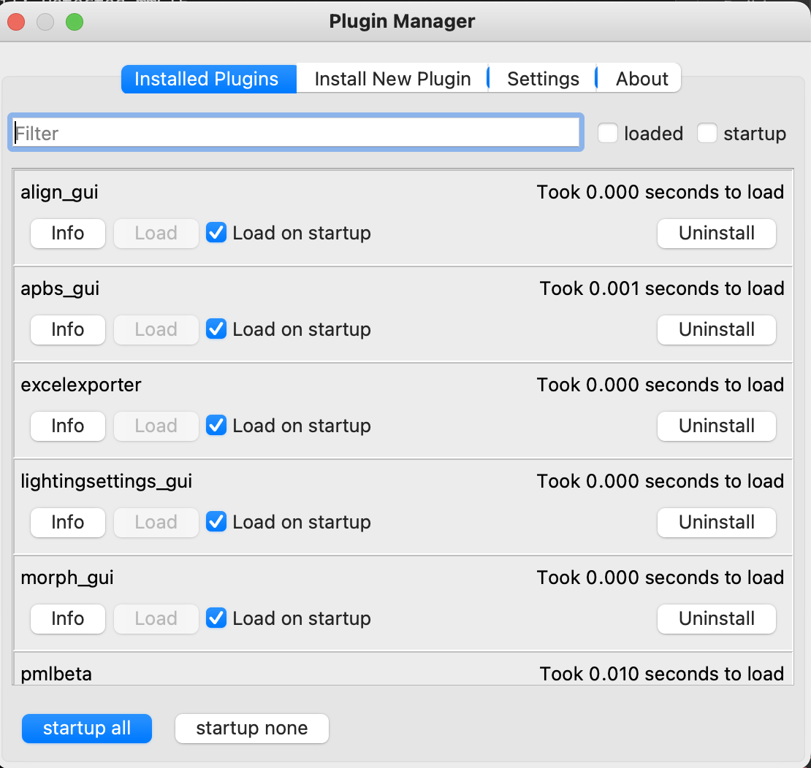
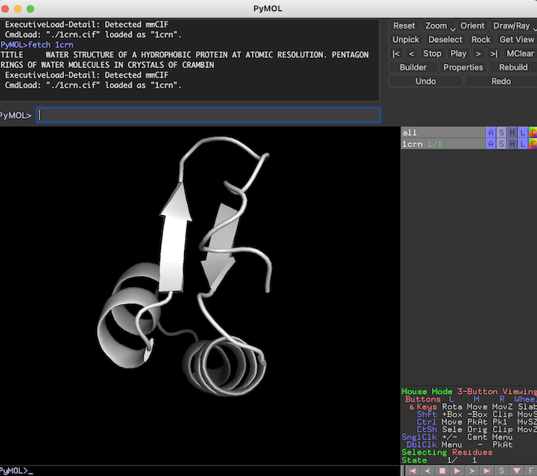
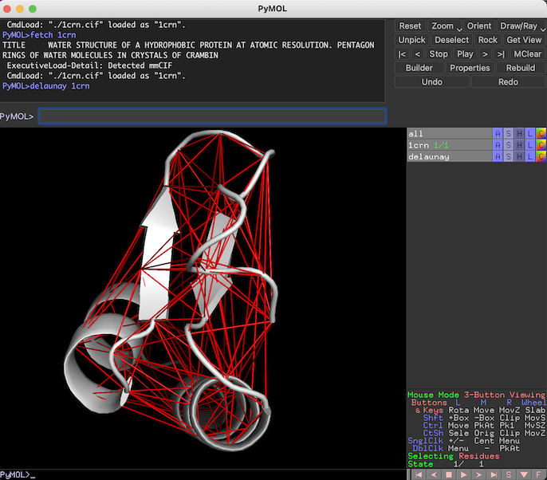

# PyDelaunay
A Python library and PyMOL extension for extracting Delaunay simplices from protein coordinates.

PyDelaunay has two main **features**:

1. Generate simplex structures from 3d coordinates
2. Export structures to CSV file

There are two **modes** for using PyDelaunay:
1. From the Python command line (or from another Python module)
2. In PyMOL using custom commands

## User Guide
### Python


#### Example 1: Single protein from PDB

```Python
simplices = delaunay_pdb.simplices_from_pdb('1crn', '~/Downloads')
delaunay_core.write_simplices(simplices, '~/data', '1crn')
```

#### Example 2: Process batch of proteins
```Python
simplices = delaunay_pdb.process_batch_pdb_simplices(['1crn', '1l2y'], '~/Downloads')
```

#### Example 3: Process ALL proteins in PDB
```Python
simplices = delaunay_pdb.process_all_current_pdbw('~/Downloads')
```

### PyMOL Extension

#### Installation
From menu:

Plugin -> Plugin Manager



<br>
<br>
Install New Plugin -> Choose File


<br>
Navigate to **PyMOL-Install.zip**, located in this repository and add

#### Extract Delaunay Simplices

1CRN example

From PyMOL command line, enter "fetch 1crn"



<br><br>
To extract and visualize simplices, enter "delaunay 1crn"



<br><br>
To export simplices, enter "delaunay_export 1crn, [export dir]"
