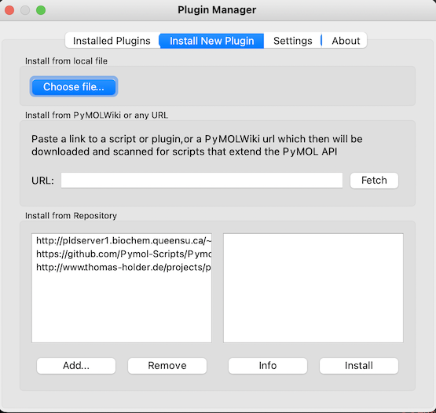

# PyDelaunay
A Python library and PyMOL extension for extracting Delaunay simplices from protein coordinates.

PyDelaunay has two main **features**:

1. Generate simplex structures from 3d coordinates
2. Export structures to CSV file

There are two **modes** for using PyDelaunay:
1. From the Python command line (or from another Python module)
2. In PyMOL using custom commands

## User Guide
### Python


#### Example 1: Single protein from PDB

```Python
simplices = delaunay_pdb.simplices_from_pdb('1crn', '~/Downloads')
delaunay_core.write_simplices(simplices, '~/data', '1crn')
```

#### Example 2: Process batch of proteins
```Python
delaunay_pdb.process_batch_pdb_simplices(['1crn', '1l2y'], '~/Downloads')
```

#### Example 3: Process ALL proteins in PDB
```Python
delaunay_pdb.process_all_current_pdbs('~/Downloads')
```

### PyMOL Extension

#### Installation
From menu:

Plugin -> Plugin Manager


<br>
<br>
Install New Plugin -> Choose File



<br>
Navigate to PyMOL-Install.zip, located in this repository and add

<br>

#### Extract Delaunay Simplices

1CRN example

From PyMOL command line, enter "fetch 1crn"


<br><br>
To extract and visualize simplices, enter "delaunay 1crn"


<br><br>
To export simplices, enter "delaunay_export 1crn, [export dir]".  This creates a csv file named 1crn.csv, where each row is a 
simplex and written out in the format of A1,A2,A3,A4,I1,I2,I3,I4.  A1-A4 are the one letter of the amino acid codes of the 
given simplex and I1-I4 are the amino acid indices (zero-based).

### Sequential Description using Simplices
<br><br>
Delaunay simplices can also be used to describe a molecule sequentially by residue (Roach, et al 2005<sup>1</sup>).  PyDelaunay provides this functionality through the delaunay_export_residues command.  Continuing with our example, enter 
"delaunay_export_residues 1crn, [export dir], [True/False]".  The last parameter directs the calculation to run in either 
the forward (True) direction or the backwards (False) direction.  This creates a text file named 1crn_del_residues_[f/b].txt, 
where f/b would indicate forward or backward.

<sup>1</sup>Roach, Jeffrey, Shantanu Sharma, Maryna Kapustina, and Charles W. Carter Jr. 2005. “Structure Alignment via Delaunay Tetrahedralization.” Proteins 60 (1): 66–81.
```rust

```
